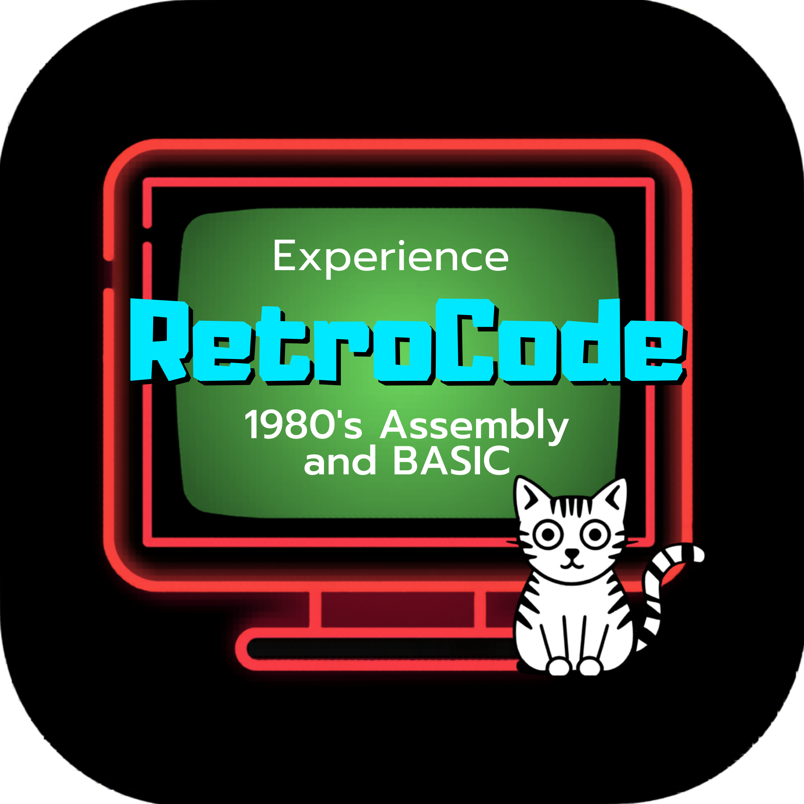
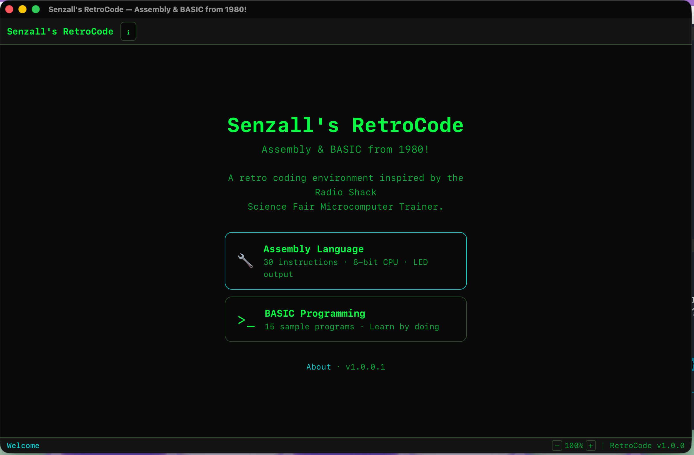
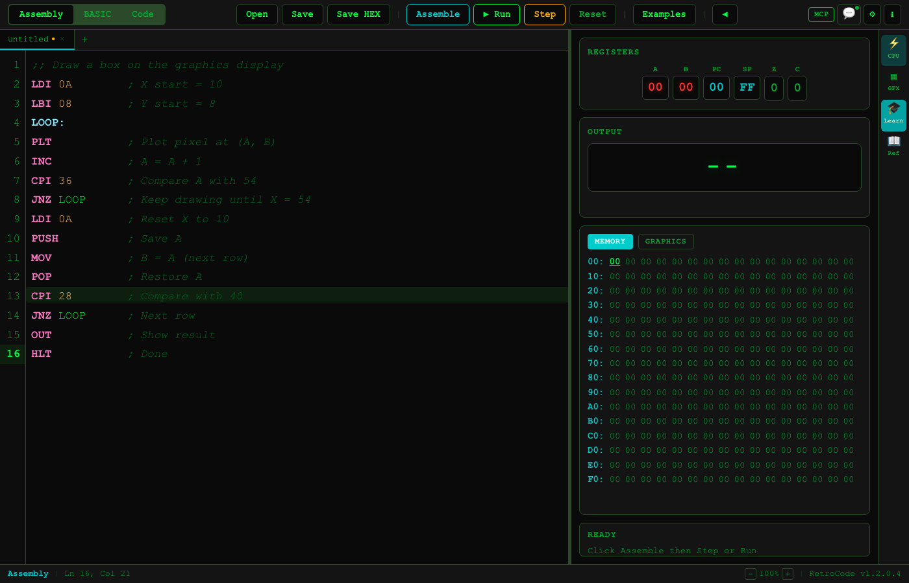
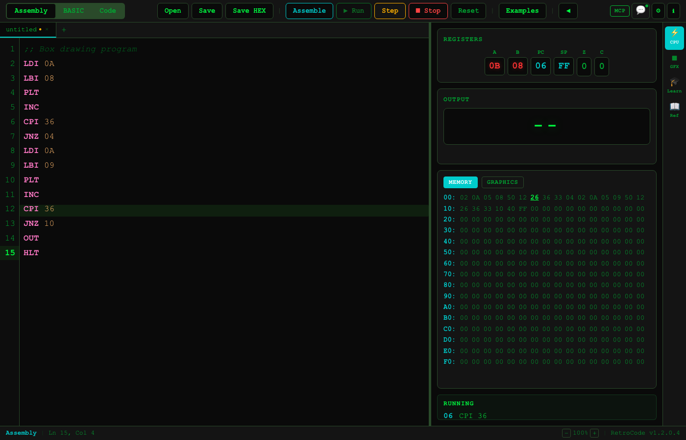
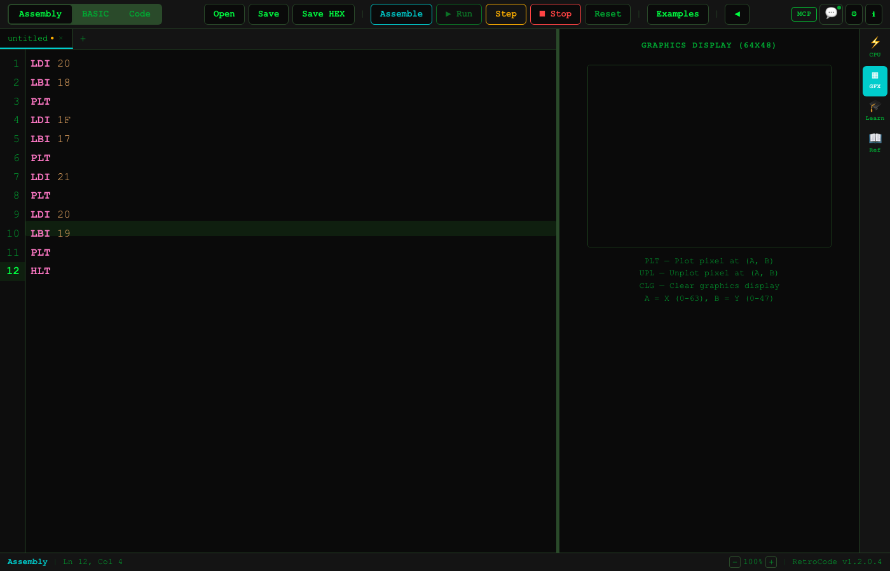
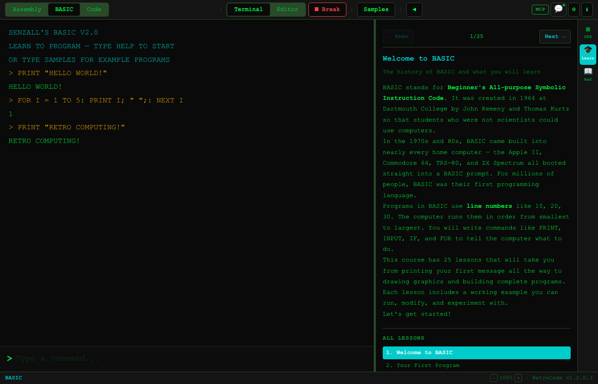
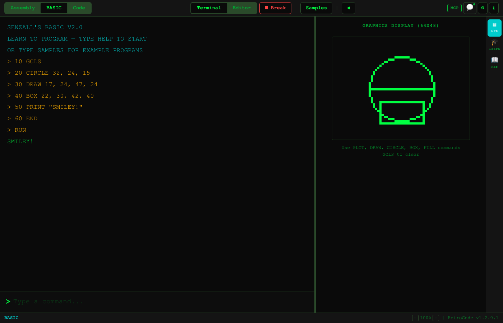
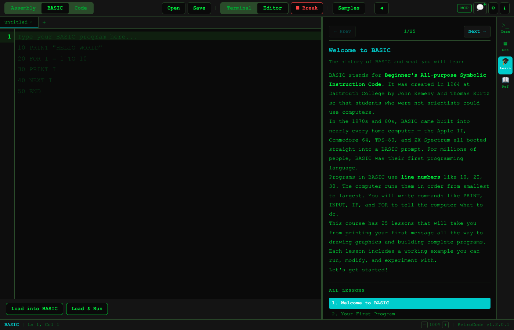

<p align="center">
  
</p>

<h1 align="center">Senzall's RetroCode</h1>
<p align="center"><strong>Assembly & BASIC from 1980!</strong></p>
<p align="center">A free desktop IDE for learning 8-bit assembly language and BASIC programming.<br>Inspired by the Radio Shack Science Fair Microcomputer Trainer.</p>

---

## Download

| Platform | Download | Requirements |
|----------|----------|-------------|
| **macOS (Apple Silicon)** | [RetroCode_1.0.0_aarch64.dmg](https://github.com/senzalldev/retrocode/releases/latest/download/RetroCode_1.0.0_aarch64.dmg) | macOS 12+ (signed & notarized) |
| **macOS (Intel)** | [RetroCode-macOS-x64.zip](https://github.com/senzalldev/retrocode/releases/latest/download/RetroCode-macOS-x64.zip) | macOS 12+ |
| **Windows** | [RetroCode-Windows-x64.zip](https://github.com/senzalldev/retrocode/releases/latest/download/RetroCode-Windows-x64.zip) | Windows 10+ |

[All releases](https://github.com/senzalldev/retrocode/releases) | [Website](https://senzall.com/retrocode)

---

## Screenshots















---

## What's Inside

### Assembly Mode
Write machine code for a simple 8-bit CPU with **36 instructions**. Watch registers change, memory update, and pixels appear on a 64x48 graphics display — all in real time.

- Step-through debugging — one instruction at a time
- Label support — modern assembler with forward references
- 19 example programs
- CPU state panel with registers, flags, and memory dump

### BASIC Mode
Program in BASIC V2.0, the language that came built into every home computer of the 1980s. A retro green terminal with a `>` prompt.

- 40+ commands — PRINT, INPUT, IF/THEN, FOR/NEXT, GOSUB, arrays, DATA/READ
- Math & string functions — SIN, COS, LEN, LEFT$, MID$, CHR$
- 64x48 bitmap graphics — PLOT, DRAW, CIRCLE, BOX, FILL
- 31 sample programs

### Learn Tab
- **26 Assembly lessons** — from "What is a CPU?" to drawing graphics
- **25 BASIC lessons** — from "Hello World" to building complete programs
- Built-in reference panels always visible

---

## Quick Reference

### Assembly (36 opcodes)

```
LDI 0A      ; Load 10 into A
LBI 05      ; Load 5 into B
ADD         ; A = A + B = 15
OUT         ; Display A
LOOP: DEC   ; A = A - 1 (label!)
JNZ LOOP    ; Jump back if not zero
PLT         ; Plot pixel at (A, B)
HLT         ; Stop
```

### BASIC

```basic
10 PRINT "HELLO WORLD"
20 FOR I = 1 TO 10
30 PRINT I * I
40 NEXT I
50 CIRCLE 32, 24, 15
60 END
```

---

## Features

- **Split-pane IDE** with code editor + CPU state / terminal / graphics
- **4 themes** — Retro, Dark, Light, RPG
- **File I/O** — save/load .asm, .bas, .hex files
- **UI zoom** — 75% to 150%
- **Keyboard shortcuts** — Cmd+R, Cmd+S, F10
- **133 unit tests**

---

## Documentation

- [Full documentation (Wiki)](https://github.com/senzalldev/retrocode-app/wiki)
- [Getting Started](https://github.com/senzalldev/retrocode-app/wiki/Getting-Started)
- [Assembly Reference](https://github.com/senzalldev/retrocode-app/wiki/Assembly-Reference)
- [BASIC Reference](https://github.com/senzalldev/retrocode-app/wiki/BASIC-Reference)
- [Graphics Guide](https://github.com/senzalldev/retrocode-app/wiki/Graphics-Guide)
- [Keyboard Shortcuts](https://github.com/senzalldev/retrocode-app/wiki/Keyboard-Shortcuts)
- [FAQ](https://github.com/senzalldev/retrocode-app/wiki/FAQ)

---

## The Story

In 7th grade, Senzall's dad surprised him with a TRS-80 Color Computer — powered by the Motorola 6809 CPU that his dad's team at Motorola helped build. Before that, he'd been writing BASIC programs at Radio Shack store windows since age 12. RetroCode recreates that experience for a new generation.

---

**[senzall.com/retrocode](https://senzall.com/retrocode)** | **[Download](https://github.com/senzalldev/retrocode/releases/latest)** | **[Report Issue](https://github.com/senzalldev/retrocode-app/issues)**

Copyright 2026 Senzall. All rights reserved. Free to download and use.
